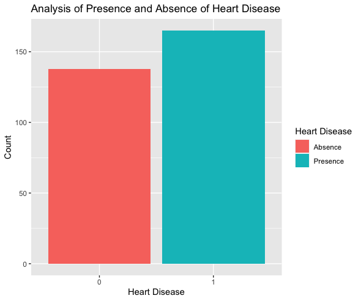
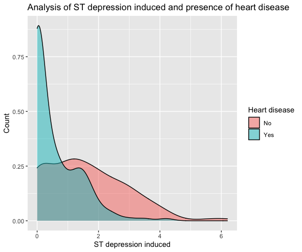
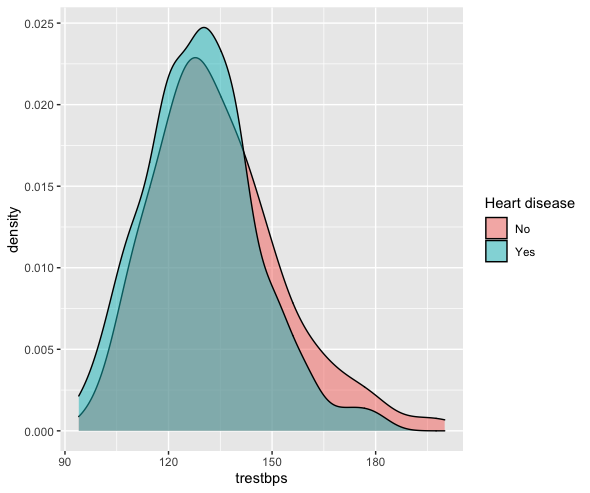

## Introduction
  In this research project I want to understand what attributes of both the human body and attributes of the heart relate to heart diseases. My interest derives from the fact that I am currently under diagnosis for my own heart related disease and would like to become more versed in understanding what attributes that I myself should look into and moreover gain a better understanding of the terminology in the cardiology field. This will hopefully empower me to be more able to understand the terminology when discussing treatment options with my doctor as my diagnosis continues. I feel this understanding will help put myself more at ease as I go through this tough time and help me not feel overwhelmed by the overall jargon the doctors will be using when discussing any problems I may or may not have. 
  I am particularly going to look at the UCI Heart disease dataset because it correlates directly to real life patient data and is well structured data. In an attempt to see what attributes I should look at when trying to predict heart disease. I want to find out if heart disease is more related to attributes of the body such as age and gender or more so to attributes of the organ itself. As well as understand which features are more related to each other under the guise of heart disease. I am interested in mainly seeing how age, gender, blood pressure, resting electrocardiographic measurement seem to have a impact the overall chances of having a heart disease.

## Background Dataset info
The original dataset is from the UCI which is a repository for datasets for developing and working with machine learning algorithms. However, the original distributors of the datasets were University Hospital, Zurich, Switzerland: William Steinbrunn, M.D, University Hospital, Basel, Switzerland: Matthias Pfisterer, M.D, V.A.Medical Center, Long Beach and Cleveland Clinic Foundation: Robert Detrano,M.D., Ph.D. These are the following features of my dataset.

### Features of the data set
*  age: The person’s age in years
*  sex: The person’s sex (1 = male, 0 = female)
*  cp: The chest pain experienced (Value 1: typical angina, Value 2: atypical angina, Value 3: non-anginal pain, Value 4: asymptomatic)
*  trestbps: The person’s resting blood pressure (mm Hg on admission to the hospital)
*  chol: The person’s cholesterol measurement in mg/dl
*  fbs: The person’s fasting blood sugar (if > 120 mg/dl, 1 = true; 0 = false)
*  restecg: Resting electrocardiographic measurement (0 = normal, 1 = having ST-T wave abnormality, 2 = showing * probable or definite left ventricular hypertrophy by Estes’ criteria)
*  thalach: The person’s maximum heart rate achieved
*  exang: Exercise induced angina (1 = yes; 0 = no)
*  oldpeak: ST depression induced by exercise relative to rest (‘ST’ relates to positions on the ECG plot)
*  slope: the slope of the peak exercise ST segment (Value 1: upsloping, Value 2: flat, Value 3: downsloping)
*  ca: The number of major vessels (0-3)
*  thal: A blood disorder called thalassemia (1 = normal; 2 = fixed defect; 3 = reversable defect)
*  target: Heart disease (0 = no, 1 = yes)

## Set working directory for file managment
```{r setup_directory}
setwd("~/Desktop/Coding/R_Programming/Heart_Data")
```
You should change this line of code to match your own path to the given directory

## Install any needed packagess

```{r install}
install.packages("dplyr",repos = "http://cran.us.r-project.org")
install.packages("tidyverse",repos = "http://cran.us.r-project.org")
install.packages("corrplot",repos = "http://cran.us.r-project.org")
install.packages("ggcorrplot",repos = "http://cran.us.r-project.org")
install.packages("ggplot2",repos = "http://cran.us.r-project.org")
install.packages("plyr",repos = "http://cran.us.r-project.org")
install.packages("caTools",repos = "http://cran.us.r-project.org")
install.packages("RColorBrewer",repos = "http://cran.us.r-project.org")
install.packages("rpart",repos = "http://cran.us.r-project.org")
install.packages("rpart.plot",repos = "http://cran.us.r-project.org")
install.packages("naniar",repos = "http://cran.us.r-project.org")
```

```{r path_libs_to_env}
library(plyr)
library(tidyverse)
library(dplyr)
library(corrplot)
library(corrplot)
library(ggcorrplot)
library(ggplot2)
library(RColorBrewer)
library(rpart)
library(rpart.plot)
library(naniar)
```

## Import csv file of dataset
```{r imort_csv}
heart_df <- read.csv("Datasets/heart.csv")
```

## Quick look at the dimensions
```{r quick_look_dataframe}
head(heart_df)
nrow(heart_df)
ncol(heart_df)
```

## Summary of heart dataset
```{r quick_look_summary}
str(heart_df)
summary(heart_df)
```

## Display any missing data
```{r missing_data_graph}
vis_miss(heart_df)
```

There is no missing data for this dataset so no cleaning will be needed. (Thank the data gods!)

## Stat testing age between those with or without heart disease
```{r t_test_age_target}
t.test(heart_df$age ~ heart_df$target, mu = 0, alt = "two.sided", conf = 0.95, var.eq = FALSE, paired = FALSE)
```

The null hypothesis is: there is no difference in average age between those with or without heart disease.

The p-value is near zero, thus we can reject our null hypothesis and with 95% confidence say there is a statistically significant difference between the average age of those who have heart disease vs those who do not.

The confidence interval also does not include zero, therefore, it supports our rejection of the null.

## Stat testing cholesterol between those with or without heart disease
```{r t_test_cholesterol_target}
t.test(heart_df$chol ~ heart_df$target, mu = 0, alt = "two.sided", conf = 0.95, var.eq = FALSE, paired = FALSE)
```

Our null hypothesis states: There is no difference between the average cholesterol levels of a patient with heart disease and of a patient without heart disease.

Our p-value shows that the probability of getting our results/extremes, assuming the null hypothesis is true, will happen 13.6% of the time. Therefore, we cannot reject our null hypothesis.

Also since the 95% confidence interval includes zero, it supports our failure to reject the null hypothesis.

## Stat testing  blood pressure between those with or without heart disease
```{r t_test_blood_pressure_target}
t.test(heart_df$trestbps ~ heart_df$target, mu = 0, alt = "two.sided", conf = 0.95, var.eq = FALSE, paired = FALSE)
```

The null hypothesis is: there is no difference in average blood pressure between those with or without heart disease.

The p-value is 1.3% which is less than 5%, therefore we can reject our null hypothesis and with 95% confidence say there is a statistically significant difference between the average blood pressure of those who have heart disease vs those who do not.

The confidence interval also does not include zero, therefore, it supports our rejection of the null.s


## Displaying the coralation matrix
```{r corr_df}
corr <- cor(heart_df)
```
#s# Visualize the correlation matrix
```{r corr_df_plot}
corrplot(corr)
```

It is a good rule of thumb to always look at the correlation of each of your features with one another. The correlation map helps when measuring the extent of relationship between multiple variables in one given figure. This helps when trying to decide which features to remove when trying when going about feature reduction for better statistical analysis and modeling. To do this I simply generate a correlation plot map. We can see from the given correlation plot the our dependent variable is least related with fbs, chol, trestbps, restecg because they are between -0.2, and  0.2.

## Deleting not related features
```{r remove_corr_features}
heart_df = subset(heart_df, select = c(-fbs,-chol,-restecg))
```

## Bar plot for target (Heart disease) 
```{r bar_plot_target}
target <- as.factor(heart_df$target)
ggplot(heart_df, aes(x=heart_df$target, fill=heart_df$target)) + 
  geom_bar() +
  xlab("Heart Disease") +
  ylab("Count") +
  ggtitle("Presence and Absence of Heart Disease") +
  scale_fill_discrete(name = "Heart Disease", labels = c("Absence", "Presence"),)
```
  


## Analysis of gender
```{r plot_gender}
ggplot(heart_df, aes(x= heart_df$sex, fill=heart_df$target)) + 
  geom_bar() +
  xlab("Gender") +
  ylab("Gender Count") +
  ggtitle("Analysis of Gender") +
  scale_fill_discrete(name = "Heart disease", labels = c("No", "Yes"))
```

When thinking about gender I would expect more males to have greater heart disease due to the fact they are generally physically bigger individuals and therefore their heart strain must be greater and thus increasing the chances of disease. But upon looking at the data for gender when compared against heart disease, we see that our dataset has more females then males, nearly a 1 to 2 ratio, making our data imbalanced for this feature and as a result we can not use this is untrustworthy for decision making when related to heart disease. 


  

## Remove gender
```{r remove_gender_feature}
heart_df = subset(heart_df, select = c(-sex))
```

## Bar plot for the chest pain experienced 
```{r plot_chest_pain}
ggplot(heart_df, aes(x= cp, fill=cp)) + 
  geom_bar() +
  xlab("Chest Pain Type") +
  ylab("Count") +
  ggtitle("Analysis of Chest Pain Experienced") +
  scale_fill_discrete(name = "Chest Pain Type", labels = c("Typical angina pain", "Atypical angina pain", "Non-Anginal pain", "Asymptomatic pain"))
```

## Density plot for oldpeak ~ target
```{r plot_oldpeak_by_target}
ggplot(heart_df, aes(x = oldpeak, fill = target)) +
  geom_density(alpha=0.5) +
  xlab("ST depression induced") +
  ylab("Count") +
  ggtitle("Analysis of ST depression induced and presence of heart disease") +
  scale_fill_discrete(name = "Heart disease", labels = c("No", "Yes"))
```

From the above graph, we can see that as the value of the old peak increases the chances of heart disease decreases. Thus highlighting the importance of this given feature when creating a statistical model or running any basic statistical data. I am surprised to see how this feature seems to impact the target feature heart disease.

  

## Density graph for trestbps (resting blood pressure)
```{r trestbps_density_graph}
ggplot(heart_df, aes(x = trestbps, fill = target)) +
  geom_density(alpha=0.5) +
  scale_fill_discrete(name = "Heart disease", labels = c("No", "Yes"))
```
There is very little difference between the comparison of the feature trestbps and our target heart disease. So, we can remove this feature before model implementation.

```{r remove_trestbps}
heart_df = subset(heart_df, select = c(-trestbps))
```

  

## Plot for slope ~ target
```{r st_seg_plot}
ggplot(heart_df, aes(x= slope, fill=target)) + 
  geom_bar(position = 'dodge') +
  xlab("slope of the peak exercise ST segment") +
  ylab("count") +
  ggtitle("Analysis of slope of the peak exercise ST segment with presence or absense of heart disease") +
  scale_fill_discrete(name = "Heart disease", labels = c("No", "Yes"))
```

## Group the different ages in three groups (young, middle, old)
```{r group_continous_data_of_feature_age}
# Group the different ages in three groups (young, middle, old)
young <- heart_df[which((heart_df$age<45)), ]
middle <- heart_df[which((heart_df$age>=45)&(heart_df$age<55)), ]
elderly <- heart_df[which(heart_df$age>55), ]
groups <- data.frame(age_group = c("young","middle","elderly"), group_count = c(NROW(young$age), NROW(middle$age), NROW(elderly$age)))
```

## Ploting different age groups
```{r plot_age_groups}
ggplot(groups, aes(x=groups$age_group, y=groups$group_count, fill=groups$age_group)) + 
  ggtitle("Age Analysis") +
  xlab("Age Group")  +
  ylab("group Count") +
  geom_bar(stat="identity") +
  scale_fill_discrete(name = "Age Group", labels = c("Elderfly", "Middle", "Young"))
```
I converted feature age of continuous data into categorical data of young, middle-aged, and elderly. Doing so also gave it a more clean look and simplified look of the given age data. There seems to be more elderly patients than both middle aged and young grouping. This gives us a general look at what kind of patients we are looking at in terms of age.

# Adding the age groups to the dataset
```{r add_new_feature_of_categorical_age}
heart_df <- cbind(heart_df, age_groups = ifelse((heart_df$age<45), 0, ifelse((heart_df$age>=45)&(heart_df$age<55), 1, 2)))
heart_df$age_groups <- as.factor(heart_df$age_groups)
```

```{r remove_old_age}
heart_df
heart_df = subset(heart_df, select = c(-age))
heart_df
```


## Create train/test split
```{r create_train_test_split}
set.seed(2031)
require(caTools)
split = sample.split(heart_df$target, SplitRatio = 0.75)
train = subset(heart_df, split==TRUE)
test = subset(heart_df, split==FALSE)
```

## Create and train a simple decision tree
```{r display_tree}
tree = rpart(target~., data=train, method='class')
prp(tree)
```

## Get results of tree on testing data
```{r tree_test_results}
predictTree = predict(tree, newdata=test, type='class')
table(test$target, predictTree)
(22 + 38)/nrow(test)
```

The model is telling us that the features that chest pain,the number of major vessels, and the maximum heart rate achieved impacts the decision the most when making a decision on whether or not the patient has a heart disease. But sadly we only got a 80% on this model for our testing data, this isn’t terrible but it doesn’t truly capture the full understanding that we would like to see to make a more significant claim. However, this does personally tell me that my own individual chest pain is nothing to scoff as it might truly relate to a more underlying issue.


## Reflection data
Luckily my data was very clean and I was not missing anything in any of my features, thus I had to do no data cleaning for my dataset. When looking at my data flow pipeline I was constantly thinking about what features may or may not make the most sense and impact in determining heart disease. Originally I thought gender and blood pressure would be impactful, but my dataset shows that these features do not make as much of an impact as I once thought. Looking at my decision tree tells us that the features of chest pain,  number of major vessels, and the maximum heart rate achieved impacts the decision the most when making a determination on whether or not the patient has heart disease. But sadly we only got an 80% on this model for our testing data. This in itself is not terrible but it does not truly capture the full understanding that we would like to see to make a more significant claim.  However, this does personally tell me that my own individual chest pain is nothing to scoff at as it might truly relate to a more underlying issue. If I were to start this project over again I would like to find a bigger dataset than only 300 patients.
The most time consuming part of this project was not necessarily the data itself but mainly learning how to program in R and likewise how to work with R studio. I was very confused about how to manage R sessions and thought there was an environment I had to point to for individual projects, but as it turns out each R session has zero packages and you install them into your own session from the code. My own concept of Python environments posed some problems and made me spend more time than needed. I also spent a few hours trying to get R to work in Jupyter Notebooks because of my familiarity with notebooks, but I kept getting strange errors that were crashing any R notebook I would try to spin up. To continue with, R markdown for notebooks took a few tries to properly run due to Knit complaining about cran repositories and lines of code needing to be encapsulated in uniquely defined markdown titles. However, the overall hardest part was simply learning and getting used to the general feel of the syntax. I had a difficult time getting used to the concept of piping and plotting differently as well as learning how to properly use the R markdown of Knit. I felt slowed down and hindered since I knew the same code in Python and constantly found myself typing code for Python by accident and wanting to call seaborn graphs. I hope to have more projects in the future in R to get more well versed in the syntax so it does not feel so foriegn to me and in turn I will add more to my own data scientist arsenal.


## Conclusion
The purpose of this project was to find what features and likewise the values of those features seem to impact the determination of classifying heart disease the most. Looking at my statistical testing we do find that cholesterol actually is significant enough to consider it for further analysis and modeling which lines up with my general understanding of heart disease/problems. However, I was conflicted in removing the feature of resting blood pressure due to the fact my statistical test made it seem impactful. But when looking at the visualizations it did not appear that it would hold a significant impact. If given more time I would love to go back and experiment more with this feature. The model is telling us that the features of chest pain, the number of major vessels, and the maximum heart rate achieved impacts the decision the most when determining whether or not the patient has a heart disease. This makes sense as the number of major vessels changes the strain on the heart that could result in a disease as well as the maximum heart rate of the patient.  With an 80% accuracy, there is still rom to grow. Moving forward, I feel as though more patient data would increase the complexity curve of the model making the given accuracy of 80% more impressive. 
The findings from this study are crucial for the medical experts who work with cardiac patients. The information allows doctors to use certain factors to determine a patient’s future with heart disease. The more clear understanding we have of warning signs, the likelihood of survival increase.  Preventative measures can take place before the patient is in crisis. This study is worth exploring further to allow cardiac patients to have a better quality of life. 


