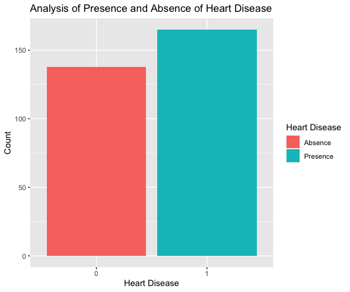

  In this research project I want to understand what attributes of both the human body and attributes of the heart relate to heart diseases. My interest derives from the fact that I am currently under diagnosis for my own heart related disease and would like to become more versed in understanding what attributes that I myself should look into and moreover gain a better understanding of the terminology in the cardiology field. This will hopefully empower me to be more able to understand the terminology when discussing treatment options with my doctor as my diagnosis continues. I feel this understanding will help put myself more at ease as I go through this tough time and help me not feel overwhelmed by the overall jargon the doctors will be using when discussing any problems I may or may not have. 
  I am particularly going to look at the UCI Heart disease dataset because it correlates directly to real life patient data and is well structured data. In an attempt to see what attributes I should look at when trying to predict heart disease. I want to find out if heart disease is more related to attributes of the body such as age and gender or more so to attributes of the organ itself. As well as understand which features are more related to each other under the guise of heart disease. I am interested in mainly seeing how age, gender, blood pressure, resting electrocardiographic measurement seem to have a impact the overall chances of having a heart disease.

### Features of the data set
*  age: The person’s age in years
*  sex: The person’s sex (1 = male, 0 = female)
*  cp: The chest pain experienced (Value 1: typical angina, Value 2: atypical angina, Value 3: non-anginal pain, Value 4: asymptomatic)
*  trestbps: The person’s resting blood pressure (mm Hg on admission to the hospital)
*  chol: The person’s cholesterol measurement in mg/dl
*  fbs: The person’s fasting blood sugar (if > 120 mg/dl, 1 = true; 0 = false)
*  restecg: Resting electrocardiographic measurement (0 = normal, 1 = having ST-T wave abnormality, 2 = showing * probable or definite left ventricular hypertrophy by Estes’ criteria)
*  thalach: The person’s maximum heart rate achieved
*  exang: Exercise induced angina (1 = yes; 0 = no)
*  oldpeak: ST depression induced by exercise relative to rest (‘ST’ relates to positions on the ECG plot)
*  slope: the slope of the peak exercise ST segment (Value 1: upsloping, Value 2: flat, Value 3: downsloping)
*  ca: The number of major vessels (0-3)
*  thal: A blood disorder called thalassemia (1 = normal; 2 = fixed defect; 3 = reversable defect)
*  target: Heart disease (0 = no, 1 = yes)

## Set working directory for file managment
```{r setup_directory}
setwd("~/Desktop/Coding/R_Programming/Heart_Data")
```
You should change this line of code to match your own path to the given directory

## Install any needed packagess

```{r install}
install.packages("dplyr",repos = "http://cran.us.r-project.org")
install.packages("tidyverse",repos = "http://cran.us.r-project.org")
install.packages("corrplot",repos = "http://cran.us.r-project.org")
install.packages("ggcorrplot",repos = "http://cran.us.r-project.org")
install.packages("ggplot2",repos = "http://cran.us.r-project.org")
install.packages("plyr",repos = "http://cran.us.r-project.org")
install.packages("caTools",repos = "http://cran.us.r-project.org")
install.packages("RColorBrewer",repos = "http://cran.us.r-project.org")
```

```{r path_libs_to_env}
library(plyr)
library(tidyverse)
library(dplyr)
library(corrplot)
library(corrplot)
library(ggcorrplot)
library(ggplot2)
library(RColorBrewer)
```

## Import csv file of dataset
```{r imort_csv}
heart_df <- read.csv("Datasets/heart.csv")
```

## Quick look at the dimensions
```{r quick_look_dataframe}
head(heart_df)
nrow(heart_df)
ncol(heart_df)
```

## Summary of heart dataset
```{r quick_look_summary}
str(heart_df)
summary(heart_df)
```

## Displaying the coralation matrix
```{r corr_df}
corr <- cor(heart_df)
```
#s# Visualize the correlation matrix
```{r corr_df_plot}
corrplot(corr)
```

Finally it is a good rule of thumb to always look at the correlation of each of your features with one another. To do this I simply generate a correlation plot map. We can see from the given correlation plot the our dependent variable is least related with fbs, chol, trestbps, restecg because they are between -0.2, and  0.2.

We can see from the given correlation plot the our dependent varible is least related with fbs, chol, trestbps, restecg because they are between -0.2, and  0.2.

## Deleting not related features
```{r remove_corr_features}
heart_df = subset(heart_df, select = c(-fbs,-chol,-restecg))
```

## Bar plot for target (Heart disease) 
```{r bar_plot_target}
target <- as.factor(heart_df$target)
ggplot(heart_df, aes(x=heart_df$target, fill=heart_df$target)) + 
  geom_bar() +
  xlab("Heart Disease") +
  ylab("Count") +
  ggtitle("Presence and Absence of Heart Disease") +
  scale_fill_discrete(name = "Heart Disease", labels = c("Absence", "Presence"),)
```
  


## Analysis of gender
```{r plot_gender}
ggplot(heart_df, aes(x= heart_df$sex, fill=heart_df$target)) + 
  geom_bar() +
  xlab("Gender") +
  ylab("Gender Count") +
  ggtitle("Analysis of Gender") +
  scale_fill_discrete(name = "Heart disease", labels = c("No", "Yes"))
```
Removing gender because heart disease should be based on metrics of the heart and not the gender of the user. Pair that with the fact that males and females have a 1 to 2 ratio. 

  

## Remove gender
```{r remove_gender_feature}
heart_df = subset(heart_df, select = c(-sex))
```

## Bar plot for the chest pain experienced 
```{r plot_chest_pain}
ggplot(heart_df, aes(x= cp, fill=cp)) + 
  geom_bar() +
  xlab("Chest Pain Type") +
  ylab("Count") +
  ggtitle("Analysis of Chest Pain Experienced") +
  scale_fill_discrete(name = "Chest Pain Type", labels = c("Typical angina pain", "Atypical angina pain", "Non-Anginal pain", "Asymptomatic pain"))
```

  

## Density plot for oldpeak ~ target
```{r plot_oldpeak_by_target}
ggplot(heart_df, aes(x = oldpeak, fill = target)) +
  geom_density(alpha=0.5) +
  xlab("ST depression induced") +
  ylab("Count") +
  ggtitle("Analysis of ST depression induced and presence of heart disease") +
  scale_fill_discrete(name = "Heart disease", labels = c("No", "Yes"))
```

From the above graph, we can see that as the value oldpeak increases the chances of heart disease decreases.

  

## Density graph for trestbps (resting blood pressure)
```{r trestbps_density_graph}
ggplot(heart_df, aes(x = trestbps, fill = target)) +
  geom_density(alpha=0.5) +
  scale_fill_discrete(name = "Heart disease", labels = c("No", "Yes"))
```
There is very little difference between the comparison of the feature trestbps and our target heart disease. So, we can remove this feature before model implementation.

```{r remove_trestbps}
heart_df = subset(heart_df, select = c(-trestbps))
```

  

## Plot for slope ~ target
```{r st_seg_plot}
ggplot(heart_df, aes(x= slope, fill=target)) + 
  geom_bar(position = 'dodge') +
  xlab("slope of the peak exercise ST segment") +
  ylab("count") +
  ggtitle("Analysis of slope of the peak exercise ST segment with presence or absense of heart disease") +
  scale_fill_discrete(name = "Heart disease", labels = c("No", "Yes"))
```
  

## Group the different ages in three groups (young, middle, old)
```{r group_continous_data_of_feature_age}
# Group the different ages in three groups (young, middle, old)
young <- heart_df[which((heart_df$age<45)), ]
middle <- heart_df[which((heart_df$age>=45)&(heart_df$age<55)), ]
elderly <- heart_df[which(heart_df$age>55), ]
groups <- data.frame(age_group = c("young","middle","elderly"), group_count = c(NROW(young$age), NROW(middle$age), NROW(elderly$age)))
```

## Ploting different age groups
```{r plot_age_groups}
ggplot(groups, aes(x=groups$age_group, y=groups$group_count, fill=groups$age_group)) + 
  ggtitle("Age Analysis") +
  xlab("Age Group")  +
  ylab("group Count") +
  geom_bar(stat="identity") +
  scale_fill_discrete(name = "Age Group", labels = c("Elderfly", "Middle", "Young"))
```

   

# Adding the age groups to the dataset
```{r add_new_feature_of_categorical_age}
heart_df <- cbind(heart_df, age_groups = ifelse((heart_df$age<45), 0, ifelse((heart_df$age>=45)&(heart_df$age<55), 1, 2)))
heart_df$age_groups <- as.factor(heart_df$age_groups)
```

```{r remove_old_age}
heart_df
heart_df = subset(heart_df, select = c(-age))
heart_df
```


  